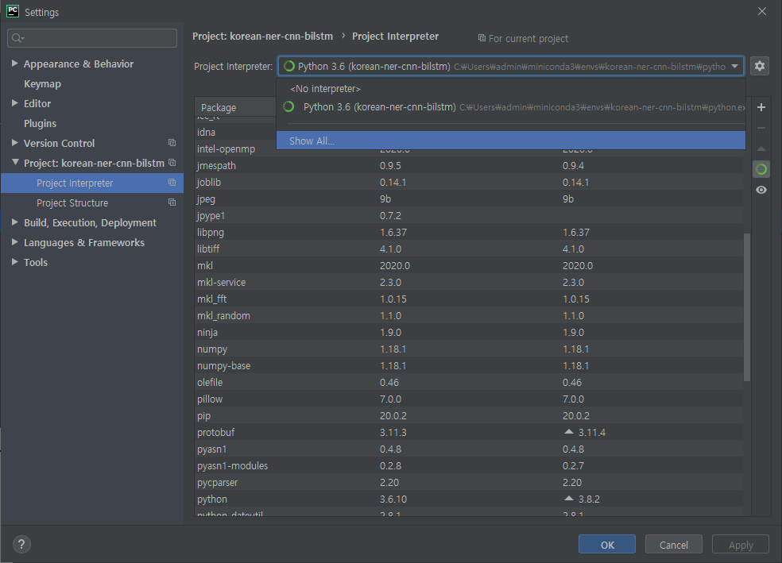
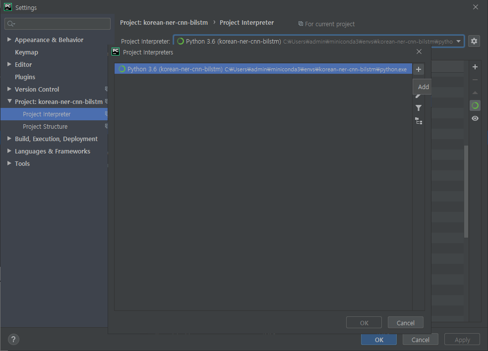

# 개체명 인식 프로젝트


## 환경 구성

OS: Windows 10  
IDE: Pycharm  
venv: Ananconda  
Language: Python 3.6  

### Pycharm + Anaconda
[PyCharm for Anaconda Community Edition](https://www.jetbrains.com/pycharm/download/download-thanks.html?code=PCC&platform=windowsAnaconda)

**miniconda 설치**

**Pycharm + Anaconda 연동**  
Pycharm - Files- Settings - Project interpreter에서 Anaconda 가상환경 생성 및 추가

<p align="center">
  
</p>

<p align="center">
  
</p>

<p align="center">
  
</p>

### 패키지

Anaconda Prompt 사용  

Pytorch : 딥러닝 라이브러리  
 ```
 conda install pytorch torchvision cudatoolkit=10.1 -c pytorch
 ```

gensim : 임베딩 라이브러리  
```
pip install gensim
```

eunjeon : 형태소 분석기 Windows용 Mecab  
1. `pip install JPype1`  
2. `pip install eunjeon`

Sklearn : 머신러닝 라이브러리  
`pip install scikit-learn`

joblib : 학습 모델 저장 라이브러리  
`pip install joblib`